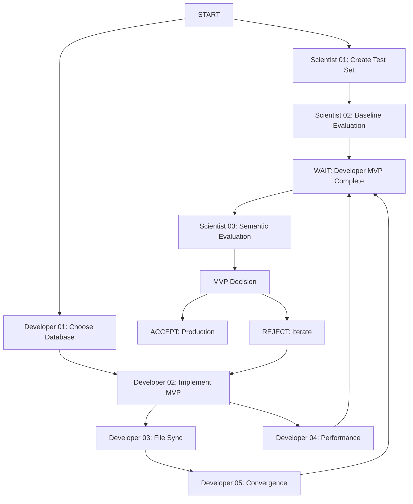

# Database Layer Implementation - Action Items Summary

**Last Updated:** 2024-12-16  
**Status:** Planning Phase

---

## Overview

This document provides a high-level overview of all action items for implementing the semantic search database layer, organized by persona (ML Scientist and Developer).

---

## Document Structure

```
docs/v1/database/
├── requirements.md                     # Requirements document (v2.0.0)
├── requirements-critique.md             # Developer critique of requirements
├── scientist-response-to-critique.md    # Scientist's response to critique
├── ACTION-ITEMS-SUMMARY.md             # This file
├── scientist/
│   ├── README.md                       # Scientist action items overview
│   ├── 01-create-evaluation-testset.md
│   ├── 02-baseline-evaluation.md
│   └── 03-semantic-search-evaluation.md
└── developer/
    └── README.md                       # Developer action items overview
```

---

## Quick Start: Who Does What?

### ML Scientist (Research & Validation)

**Total Time:** 8-12 hours over 1-2 weeks

**Action Items:**
1. **Create evaluation test set** (4-6h) - Can start immediately
2. **Run baseline evaluation** (2-3h) - After test set complete
3. **Evaluate semantic search** (2-3h) - After developer MVP complete

**Deliverables:**
- Evaluation test set with 50+ queries
- Baseline metrics (substring search)
- Semantic search metrics with comparison
- MVP acceptance/rejection recommendation

**See:** [scientist/README.md](scientist/README.md)

---

### Developer (Implementation)

**Total Time:** 4-6 days

**Action Items:**
1. **Choose vector database** (4-8h) - Can start immediately
2. **Implement MVP** (2-3 days) - Core semantic search
3. **File synchronization** (1 day) - Keep index in sync
4. **Performance validation** (4h) - Measure latency
5. **Convergence validation** (2h) - Measure sync time

**Deliverables:**
- Working semantic search integrated with MCP server
- File watcher for automatic index updates
- Performance benchmarks
- MVP ready for scientist evaluation

**See:** [developer/README.md](developer/README.md)

---

## Workflow Timeline

### Week 1

**Day 1-2: Parallel Start**
- **Scientist:** Start Action Item 01 (create test set) - 4-6 hours
- **Developer:** Start Action Item 01 (choose database) - 4-8 hours

**Day 3: Coordination**
- **Scientist:** Complete test set, share with developer
- **Developer:** Database choice made, document decision

**Day 4-6: Implementation Phase**
- **Scientist:** Run baseline evaluation (Action Item 02) - 2-3 hours
- **Developer:** Implement MVP (Action Item 02) - 2-3 days

**Day 7: File Synchronization**
- **Scientist:** Review baseline results, prepare for final evaluation
- **Developer:** Implement file watcher (Action Item 03) - 1 day

### Week 2

**Day 1-2: Validation**
- **Scientist:** Wait for MVP completion
- **Developer:** Performance validation (Action Item 04) - 4 hours
- **Developer:** Convergence validation (Action Item 05) - 2 hours

**Day 3: Hand-off**
- **Developer:** Signal MVP ready for evaluation
- **Scientist:** Start semantic search evaluation (Action Item 03)

**Day 4-5: Final Evaluation**
- **Scientist:** Complete evaluation, comparison, acceptance report
- **Developer:** Fix any critical issues found during evaluation

**Day 6: Decision**
- **Both:** Review acceptance report
- **Decision:** Accept for production / Conditional accept / Reject

---

## Critical Path

Items that MUST be completed before others can proceed:



**Blocking Dependencies:**
- Scientist 02 blocked by Scientist 01
- Scientist 03 blocked by Scientist 02 + Developer MVP (02, 04, 05)
- Developer 03, 04, 05 blocked by Developer 02
- MVP acceptance blocked by Scientist 03

---

## Acceptance Criteria Summary

### Functional (Developer Implements)
- ✅ Semantic search returns results
- ✅ Results ranked by similarity
- ✅ File synchronization works
- ✅ Index rebuild available

### Performance (Developer Validates)
- ✅ Query latency < 100ms p95
- ✅ Index rebuild < 30s for 2K contexts
- ✅ Convergence < 10s p95

### Quality (Scientist Validates)
- ✅ **Precision@5 improvement > 30%** (target)
- ✅ **Statistically significant** (p < 0.05)
- ✅ No major regressions

**If ALL criteria met:** MVP ACCEPTED for production  
**If close but not met:** CONDITIONAL ACCEPT with Phase 2 plan  
**If far from met:** REJECTED, iterate

---

## Key Decisions

### Scientist's Decisions
1. **Evaluation methodology** - What metrics, what test queries
2. **Relevance judgments** - What counts as "relevant"
3. **Acceptance threshold** - Is >25% improvement acceptable if 30% not met?

### Developer's Decisions
1. **Vector database** - ChromaDB vs LanceDB vs SQLite
2. **API integration** - New tool vs replace existing vs parameter
3. **Database schema** - How to structure embeddings + metadata
4. **File watcher** - Which library, what event handling

### Joint Decisions (Require Discussion)
1. **MVP scope changes** - If something is harder than expected, defer to Phase 2?
2. **Performance tradeoffs** - If can't meet 100ms, is 150ms acceptable?
3. **Quality tradeoffs** - If improvement is 25%, is that acceptable?

---

## Communication Protocol

### Daily Standups (Recommended During Implementation)
- Scientist: Progress on action items, any blockers
- Developer: Progress on implementation, any questions for scientist
- Sync on timeline and dependencies

### Handoff Meetings
1. **After Scientist 01:** Share test set, discuss expectations
2. **After Developer 01:** Share database choice, explain rationale
3. **After Scientist 02:** Share baseline metrics, set target
4. **Before Scientist 03:** Developer demo MVP, scientist validates ready
5. **After Scientist 03:** Review acceptance report, make decision

### Async Communication
- Use comments in action item markdown files for updates
- Create GitHub issues for bugs found during evaluation
- Document decisions in respective folders

---

## Risk Management

### Risk: Test Set Bias
**Impact:** HIGH - Invalid evaluation if test set is biased  
**Mitigation:** Scientist reviews test set with developer, ensures diversity  
**Owner:** Scientist

### Risk: Vector Database Performance
**Impact:** HIGH - May not meet 100ms latency target  
**Mitigation:** Developer benchmarks early (Action Item 01), chooses performant option  
**Owner:** Developer

### Risk: Developer MVP Delayed
**Impact:** MEDIUM - Scientist blocked on Action Item 03  
**Mitigation:** Scientist can work ahead on analysis of baseline, prepare evaluation  
**Owner:** Developer + Team Lead

### Risk: Quality Target Not Met
**Impact:** MEDIUM - May need iteration or Phase 2  
**Mitigation:** Set realistic expectations, define "conditional accept" criteria  
**Owner:** Both

### Risk: Scope Creep
**Impact:** MEDIUM - MVP takes longer if scope expands  
**Mitigation:** Refer to [requirements.md Section 9: Non-Requirements](requirements.md#9-non-requirements)  
**Owner:** Team Lead

---

## Success Metrics

### For Scientist
- [ ] Test set has 50+ diverse queries
- [ ] Baseline metrics documented
- [ ] Semantic evaluation complete
- [ ] Acceptance report written with clear recommendation

### For Developer
- [ ] Vector database chosen and justified
- [ ] MVP feature-complete and tested
- [ ] Performance targets met or documented why not
- [ ] Ready for scientist evaluation

### For Team
- [ ] MVP delivers measurable improvement (>30% target)
- [ ] System meets non-functional requirements
- [ ] Code is maintainable and well-tested
- [ ] Ready for production deployment

---

## Phase 2 Planning (Future)

If MVP is accepted, next phase includes:

1. **BM25 Lexical Search** - Additional 15-20% improvement expected
2. **Hybrid Search** - Combine semantic + BM25 with rank fusion
3. **Metadata Filtering** - If use cases emerge
4. **Performance Optimization** - Reduce latency further if needed

**Timeline:** 2-3 weeks after MVP deployed and stabilized

**See:** [requirements.md Section 11.1 (Phased Rollout)](requirements.md#111-phased-rollout)

---

## Getting Started

### For ML Scientist
1. Read [scientist/README.md](scientist/README.md)
2. Start [scientist/01-create-evaluation-testset.md](scientist/01-create-evaluation-testset.md)
3. Coordinate with developer on test set

### For Developer
1. Read [Quick Reference in requirements.md](requirements.md#quick-reference-for-developers)
2. Read [developer/README.md](developer/README.md)
3. Start [developer Action Item 01: Choose Vector Database](developer/README.md#01-choose-vector-database-rt-3)

### For Project Manager
1. Review this summary document
2. Set up communication channels (standups, issue tracker)
3. Monitor critical path and dependencies
4. Facilitate handoff meetings

---

## FAQ

### Q: Can we parallelize more?
**A:** Scientist 01-02 and Developer 01-02 are already parallelized. The only hard dependency is Scientist 03 waiting for Developer MVP.

### Q: What if 30% improvement target is too aggressive?
**A:** Document actual improvement and make case for conditional acceptance. Anthropic saw 49%, but different corpus. 20-25% may still be valuable.

### Q: What if developer MVP takes longer than 1 week?
**A:** Scientist can prepare analysis tools, review baseline in detail, help debug integration issues. Escalate to team lead if delay exceeds 2 weeks.

### Q: What if we find bugs during evaluation?
**A:** Create issues, developer fixes, re-run affected parts of evaluation. This is expected and why we do evaluation before production.

### Q: Can we skip baseline evaluation?
**A:** NO. Without baseline, we can't claim "improvement." Baseline is required for acceptance criteria.

---

## Document History

**v1.0 (2024-12-16):** Initial action items structure created  
- Scientist action items: 01-03
- Developer action items: README (detailed action items to be added)
- Requirements document v2.0.0 finalized

---

## Contact & Escalation

**ML Scientist:** [Name]  
**Developer:** [Name]  
**Technical Lead:** [Name]  
**Product Owner:** [Name]

**For Questions:** Create issue in repository  
**For Blockers:** Escalate to Technical Lead  
**For Scope Changes:** Escalate to Product Owner

---

**Ready to start? Pick your persona and dive into the respective README!**

