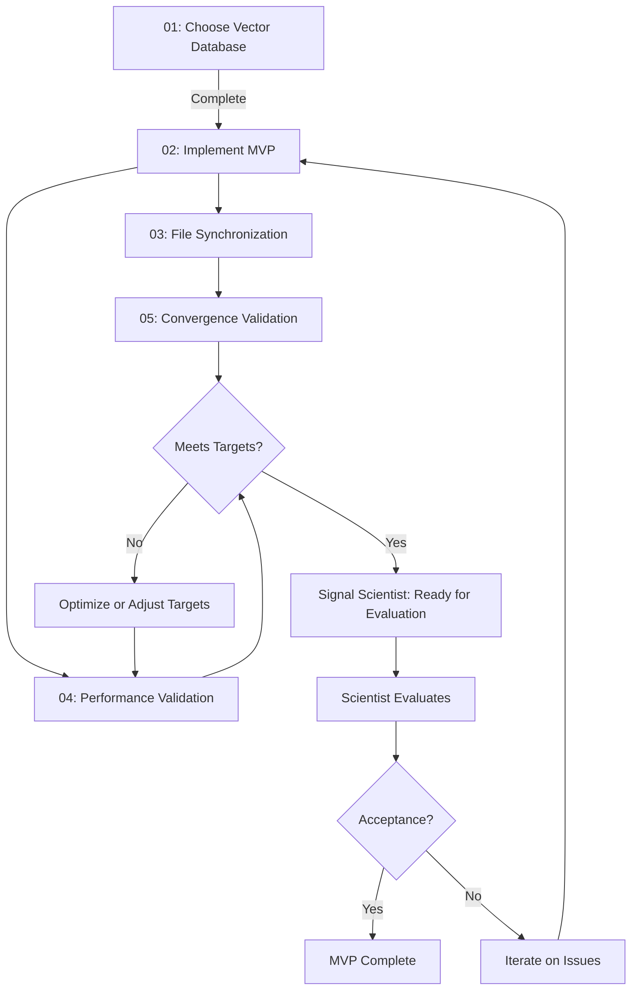

# Developer Action Items - Database Layer MVP

This directory contains all action items for the Developer persona in implementing the semantic search database layer.

---

## Action Items Overview

| # | Action Item | Status | Priority | Est. Time | Blocking? |
|---|-------------|--------|----------|-----------|-----------|
| 01 | Choose Vector Database (RT-3) | 🔴 Not Started | HIGH | 4-8h | Yes (design decision) |
| 02 | Implement MVP - Semantic Search | 🟡 Blocked by 01 | HIGH | 2-3 days | Yes |
| 03 | Implement File Synchronization | 🟡 Blocked by 02 | MEDIUM | 1 day | No (can parallelize) |
| 04 | Performance Validation (RT-1, RT-5) | 🟡 Blocked by 02 | HIGH | 4h | Yes (for acceptance) |
| 05 | Convergence Validation (RT-2, RT-7) | 🟡 Blocked by 03 | MEDIUM | 2h | No (optimization) |

**Total Estimated Time:** 4-6 days

---

## Quick Start

### What You Need to Know

1. **Read:** [Quick Reference in requirements.md](../requirements.md#quick-reference-for-developers)
2. **Understand:** You're building semantic search with local embeddings, self-contained, STDIO compatible
3. **Your Decisions:** Vector database choice, API design, database schema, file watcher implementation
4. **Success Metrics:** <100ms p95 latency, >30% quality improvement, <10s convergence

### What's Locked (Don't Change)

- ✅ Embedding model: `all-MiniLM-L6-v2`
- ✅ Consistency model: Eventual (< 10s target)
- ✅ Scale: 500k-1M tokens (1K-2K contexts)
- ✅ No chunking (full-document embedding)

### What's Your Decision

- 🔧 **Vector Database:** ChromaDB / LanceDB / SQLite+extension
- 🔧 **API Integration:** New tool / Replace search_context / Add parameter
- 🔧 **Schema Design:** Your design (must support vectors + mtime)
- 🔧 **File Watcher:** watchdog / inotify / polling

---

## Action Item Details

### 01: Choose Vector Database (RT-3)

**Goal:** Select ChromaDB, LanceDB, or SQLite+extension based on benchmarks

**Deliverable:** `01-database-choice-decision.md` documenting:
- Options evaluated (POC for each)
- Benchmark results (query latency at 2K vectors)
- Decision rationale
- Installation instructions

**Acceptance:**
- [ ] POC implemented for 2+ options
- [ ] Query latency < 50ms (leaves 50ms for embedding)
- [ ] Decision documented with rationale
- [ ] Ready to proceed with MVP implementation

**See:** [RT-3 in requirements.md](../requirements.md#rt-3-choose-vector-database-developer) for full details

---

### 02: Implement MVP - Semantic Search

**Goal:** Core semantic search functionality working end-to-end

**Deliverable:** Working semantic search feature integrated with MCP server

**Key Components:**
1. **Embedding Generation**
   - Load `all-MiniLM-L6-v2` model
   - Generate embeddings for queries
   - Generate embeddings for contexts

2. **Vector Database Integration**
   - Initialize chosen database
   - Store embeddings with context names
   - Query for top-K similar vectors

3. **MCP Tool Integration**
   - Expose as MCP tool (your choice: new tool / replace existing / parameter)
   - Return results with similarity scores
   - Handle errors gracefully

4. **Index Rebuild Command**
   - Rebuild all embeddings from .mdc files
   - Non-destructive to .mdc files
   - Show progress

**Acceptance:**
- [ ] Can query "how to train models" and get relevant results
- [ ] Results include similarity scores
- [ ] Index rebuild works from command/API
- [ ] Ready for scientist's evaluation (Action Item 03)

**See:** [Section 3 (Functional Requirements) in requirements.md](../requirements.md#3-functional-requirements)

---

### 03: Implement File Synchronization

**Goal:** Automatically detect .mdc file changes and update indices

**Deliverable:** File watcher that keeps index in sync with .mdc files

**Key Components:**
1. **File Watcher**
   - Monitor .mdc file directory
   - Detect create/modify/delete events
   - Debounce rapid changes (500ms)

2. **Index Update Logic**
   - File created → embed + insert
   - File modified → check mtime, re-embed if stale
   - File deleted → remove from index

3. **Background Processing**
   - Run in background thread/async task
   - Don't block queries or writes
   - Handle errors gracefully (log and continue)

**Acceptance:**
- [ ] Create .mdc file → appears in search within 10s
- [ ] Modify .mdc file → search results update within 10s
- [ ] Delete .mdc file → removed from search within 10s
- [ ] Convergence time measured (RT-2)

**See:** [FR-4 in requirements.md](../requirements.md#fr-4-index-synchronization-must)

---

### 04: Performance Validation (RT-1, RT-5)

**Goal:** Measure and validate latency meets < 100ms p95 target

**Deliverable:** `04-performance-validation-report.md` with benchmark results

**Benchmarks to Run:**
1. **RT-1: Query Latency**
   - Index 1K, 2K, 4K contexts
   - Run 100 test queries
   - Measure p50, p95, p99 latency
   - Break down: embedding time + search time

2. **RT-5: Embedding Speed**
   - Measure single query embedding time
   - Test with varying query lengths (5-100 tokens)
   - Validate < 50ms p95 for query embedding

**Acceptance:**
- [ ] p95 query latency < 100ms with 2K contexts
- [ ] Query embedding < 50ms p95
- [ ] Vector search < 50ms p95
- [ ] If fails: Document optimization plan or adjust target

**See:** [RT-1 and RT-5 in requirements.md](../requirements.md#8-research-tasks)

---

### 05: Convergence Validation (RT-2, RT-7)

**Goal:** Measure actual convergence time and write latency impact

**Deliverable:** `05-convergence-validation-report.md` with measurements

**Measurements:**
1. **RT-2: Convergence Time**
   - Modify .mdc file, measure time until index updated
   - Test: single file, batch of 10, batch of 50
   - Calculate p50, p95 convergence time

2. **RT-7: Write Latency**
   - Measure `put_context` latency with eager indexing
   - Compare to without indexing (if possible)
   - Test: single write, batch of 10

**Acceptance:**
- [ ] p95 convergence < 10s for single file (target)
- [ ] p95 convergence < 30s for batch of 10 (acceptable)
- [ ] Write latency < 500ms p95 (if exceeds, switch to async)

**See:** [RT-2 and RT-7 in requirements.md](../requirements.md#8-research-tasks)

---

## Workflow Sequence



---

## Your Design Decisions

### Decision 1: Vector Database

**Options:**
- **ChromaDB (embedded):** Most popular in RAG community, good docs
- **LanceDB:** Fast, Rust-based, good for larger scale
- **SQLite + sqlite-vec:** Minimal dependencies, good if familiar with SQLite

**Decision Criteria:**
1. Query latency < 50ms at our scale (1K-4K vectors)
2. Installation simplicity (fewer dependencies better)
3. API ergonomics (easier to use = faster to implement)

**Your Task:** Implement quick POC with 2 options, benchmark, document decision

---

### Decision 2: API Integration

**Options:**
1. **Replace `search_context`:** Semantic becomes default search
   - Pro: Simple for users (one search method)
   - Con: Breaking change, no way to use old search

2. **New tool `semantic_search_context`:** Keep both
   - Pro: Backwards compatible, users choose
   - Con: Two search methods, may confuse users

3. **Parameter on `search_context`:** `method="semantic"|"substring"`
   - Pro: One tool, flexible, backwards compatible (default to substring)
   - Con: More complex implementation

**Your Task:** Choose based on user experience and compatibility considerations

---

### Decision 3: Database Schema

**Must Store:**
- `context_name` (string, primary key)
- `embedding` (vector, 384 dimensions)
- `mtime` (float, for staleness detection)
- `embedding_model_version` (string, for rebuild detection)

**Optional (for future metadata filtering):**
- `created_at` (timestamp)
- `tags` (list of strings)

**Your Task:** Design schema for chosen database, document structure

---

### Decision 4: File Watcher Implementation

**Options:**
- **watchdog:** Cross-platform Python library (recommended)
- **inotify:** Linux-specific, more efficient
- **Polling:** Fallback if watchers don't work

**Your Task:** Choose library, implement event handling, test on target OS

---

## Communication with Scientist

### Handoff Points

1. **After Action Item 01:** Share database choice decision
   - Scientist should be aware of technology stack
   - No action needed from scientist yet

2. **After Action Item 02:** Share test deployment
   - Scientist can start exploring semantic search
   - Help scientist set up evaluation script

3. **After Action Items 04-05:** Share performance results
   - Scientist uses these for acceptance report
   - Discuss any issues or optimizations needed

4. **Signal MVP Ready:** When all action items complete
   - Scientist proceeds with Action Item 03 (evaluation)
   - Be available to fix bugs found during evaluation

### Questions to Ask Scientist

Before starting Action Item 02:
- What does the evaluation test set look like? (so I can test against it)
- Any specific edge cases I should handle?
- What's the format of the evaluation script? (so I can ensure compatibility)

---

## Testing Strategy

### Unit Tests
- Embedding generation
- Vector database CRUD operations
- Index synchronization logic
- mtime tracking and staleness detection

### Integration Tests
- End-to-end semantic search with real .mdc files
- File watcher → embedding → index update pipeline
- Index rebuild from scratch
- Concurrent read/write handling

### Performance Tests
- Query latency benchmarks (RT-1, RT-5)
- Index rebuild time measurement
- Convergence time measurement (RT-2, RT-7)

**Test Coverage Target:** >80% for core functionality

---

## Troubleshooting

### "Embedding model download is slow"

**Solution:** Model is ~80MB, first download may take time. Cache it:
```python
from sentence_transformers import SentenceTransformer
model = SentenceTransformer('all-MiniLM-L6-v2')
# Model cached in ~/.cache/torch/sentence_transformers/
```

### "Vector database query is slower than expected"

**Possible causes:**
1. Index not built properly (check index creation)
2. Too many vectors to search efficiently (should be fine at 1K-4K)
3. Database not optimized (check configuration)

**Action:** Profile query, check database docs for optimization tips

### "File watcher not detecting changes"

**Common issues:**
1. Path watching incorrect directory
2. File system doesn't support inotify (use polling fallback)
3. Too many files, hitting OS limits

**Action:** Test with manual file modification, add logging to watcher

### "Convergence time > 10s"

**Possible causes:**
1. Embedding generation is bottleneck (check RT-5)
2. Database insert is slow (check database performance)
3. Debouncing delay too long (reduce from 500ms)

**Action:** Profile update pipeline, optimize slowest component

---

## Deliverables Checklist

- [ ] `01-database-choice-decision.md` - Database selection documented
- [ ] Working semantic search integrated with MCP server
- [ ] File synchronization implemented and tested
- [ ] `04-performance-validation-report.md` - Latency benchmarks
- [ ] `05-convergence-validation-report.md` - Convergence measurements
- [ ] Unit tests (>80% coverage)
- [ ] Integration tests passing
- [ ] Documentation updated (README, API docs)
- [ ] Ready for scientist evaluation

---

## Tools and Scripts

### POC Scripts (Action Item 01)
Quick proof-of-concepts for each database option to benchmark.

### Benchmark Scripts (Action Items 04-05)
Scripts to measure latency, convergence time, and other performance metrics.

### Test Utilities
Helper functions for testing (mock .mdc files, fake embeddings, etc.).

---

## References

- [Requirements Document](../requirements.md) - Full requirements
- [Scientist Action Items](../scientist/README.md) - Parallel validation tasks
- [sentence-transformers Docs](https://www.sbert.net/) - Embedding model documentation
- [ChromaDB Docs](https://docs.trychroma.com/) - If choosing ChromaDB
- [LanceDB Docs](https://lancedb.github.io/lancedb/) - If choosing LanceDB

---

## Status Tracking

Update this section as action items progress:

### Latest Updates

**[Date]:** Action Item 01 - Not started  
**[Date]:** Action Item 02 - Blocked by 01  
**[Date]:** Action Item 03 - Blocked by 02  
**[Date]:** Action Item 04 - Blocked by 02  
**[Date]:** Action Item 05 - Blocked by 03

---

## Contact

**Developer:** [Your Name]  
**ML Scientist:** [Scientist Name]  
**Questions:** Create issue in repository or message in team chat

---

**Last Updated:** 2024-12-16

