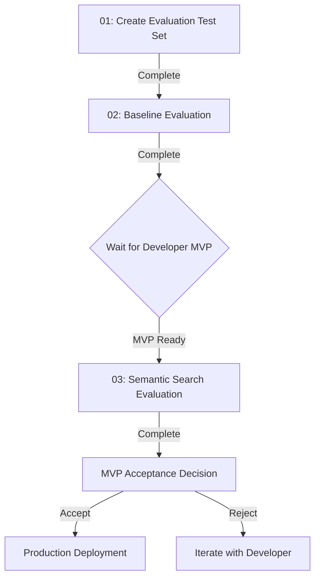

# ML Scientist Action Items - Database Layer MVP

This directory contains all action items for the ML Scientist persona in implementing and validating the semantic search database layer.

---

## Action Items Overview

| # | Action Item | Status | Priority | Est. Time | Blocking? |
|---|-------------|--------|----------|-----------|-----------|
| 01 | [Create Evaluation Test Set](01-create-evaluation-testset.md) | 🔴 Not Started | HIGH | 4-6h | Yes (for quality validation) |
| 02 | [Baseline Evaluation](02-baseline-evaluation.md) | 🟡 Blocked by 01 | HIGH | 2-3h | Yes (for comparison) |
| 03 | [Semantic Search Evaluation](03-semantic-search-evaluation.md) | 🟡 Blocked by 02 + Dev MVP | HIGH | 2-3h | Yes (for acceptance) |

**Total Estimated Time:** 8-12 hours

---

## Workflow Sequence

---

## Dependencies

### External Dependencies
- ✅ Requirements document finalized (requirements.md v2.0.0)
- ⏳ Developer implements MVP (see ../developer/)
- ⏳ MCP server running and accessible

### Internal Dependencies
- 01 → 02 (test set needed for baseline)
- 02 → 03 (baseline needed for comparison)
- Developer MVP → 03 (semantic search implementation needed)

---

## Deliverables Checklist

### From Action Item 01
- [ ] `evaluation-testset.json` - 50+ queries with relevance judgments
- [ ] `evaluation-testset-methodology.md` - Documentation of test set creation

### From Action Item 02
- [ ] `baseline-results.json` - Substring search evaluation results
- [ ] `baseline-analysis.md` - Analysis of baseline performance
- [ ] `evaluate.py` - Evaluation script (reusable for semantic search)

### From Action Item 03
- [ ] `semantic-results.json` - Semantic search evaluation results
- [ ] `semantic-vs-baseline-comparison.md` - Detailed comparison report
- [ ] `mvp-acceptance-report.md` - Final acceptance/rejection decision

---

## Acceptance Criteria for MVP

The scientist will validate that the MVP meets these criteria:

### Functional
- ✅ Semantic search returns results for all test queries
- ✅ Results ranked by similarity score
- ✅ No crashes or critical errors

### Performance
- ✅ Query latency < 100ms p95
- ✅ Index rebuild < 30s for 2K contexts
- ✅ Convergence < 10s p95

### Quality (Primary)
- ✅ **Precision@5 improvement > 30%** over baseline (target)
- ✅ **Statistically significant** (p < 0.05)
- ✅ No major regressions on test set

**If ALL criteria met:** Recommend ACCEPT for production  
**If quality criteria not met but close:** Recommend CONDITIONAL ACCEPT with Phase 2 improvements  
**If functional/performance criteria not met:** Recommend REJECT, iterate with developer

---

## Getting Started

### Step 1: Start with Action Item 01

Read [01-create-evaluation-testset.md](01-create-evaluation-testset.md) and begin creating the evaluation test set.

**Time commitment:** 4-6 hours (can be done in multiple sessions)

**Tips:**
- Start with 10-15 queries to test the format
- Validate with developer that queries are representative
- Expand to 50+ once format validated

### Step 2: Wait for Test Set Completion

Don't proceed to Action Item 02 until test set is complete and reviewed.

### Step 3: Run Baseline Evaluation

Once test set is ready, proceed to [02-baseline-evaluation.md](02-baseline-evaluation.md).

**Time commitment:** 2-3 hours

**Coordination:** May need developer help to set up evaluation script if MCP server integration is complex.

### Step 4: Block Until Developer MVP

Action Item 03 cannot start until developer completes semantic search implementation.

**What to do while waiting:**
- Review baseline results
- Identify expected improvements
- Prepare evaluation environment
- Optional: Help developer with integration testing

### Step 5: Final Evaluation

Once developer signals MVP is ready, proceed to [03-semantic-search-evaluation.md](03-semantic-search-evaluation.md).

**Time commitment:** 2-3 hours

**Output:** Final acceptance report with recommendation

---

## Communication with Developer

### Handoff Points

1. **After Action Item 01:** Share test set with developer
   - Developer can use it for their own testing
   - Ensures alignment on what "good retrieval" means

2. **After Action Item 02:** Share baseline metrics
   - Gives developer target to beat (>30% improvement)
   - Helps developer prioritize optimization

3. **During Action Item 03:** Collaborate on evaluation
   - Developer may need to fix bugs discovered during testing
   - Scientist may adjust test set if edge cases found

### Questions to Ask Developer

Before starting Action Item 01:
- What are the most common query patterns you expect?
- Are there specific edge cases I should include in test set?
- What's the best way to integrate evaluation script with MCP server?

Before starting Action Item 03:
- Is semantic search MVP feature-complete and ready for evaluation?
- What's the API for semantic search? (so evaluation script can call it)
- Are there any known issues I should be aware of?

---

## Tools and Scripts

### evaluation-testset.json (Action Item 01)
Hand-crafted test set with queries and relevance judgments.

### evaluate.py (Action Item 02)
Python script to:
- Load test set
- Query MCP server (substring or semantic)
- Calculate metrics (P@5, R@5, MRR, NDCG@10)
- Output results JSON

**Reusable for both baseline and semantic search evaluations.**

### compare.py (Action Item 03)
Python script to:
- Load baseline and semantic results
- Calculate improvement percentages
- Run statistical significance tests
- Generate comparison report

---

## Troubleshooting

### "I don't have enough contexts to create 50 queries"

**Solution:** 
- It's OK to have queries with no relevant contexts (will score 0)
- Focus on diversity over quantity initially
- Can start with 30 queries, expand to 50 later

### "Baseline performs better than expected"

**Possible causes:**
- Test set may be biased toward exact keyword matches
- Review query diversity
- Add more paraphrase/synonym-based queries

**Action:** Document in baseline analysis, don't artificially make test set harder.

### "Semantic search doesn't meet 30% improvement target"

**First steps:**
1. Check if improvement is close (e.g., 25%) - may still be acceptable
2. Analyze failure modes - where is it not improving?
3. Check latency - is it trading quality for speed?

**Escalation:** Work with developer to:
- Verify embedding model is loaded correctly
- Check if similarity scoring is working as expected
- Consider if 30% target was too aggressive for this use case

### "Developer MVP not ready - how long should I wait?"

**Timeline expectations:**
- Developer Action Items 01-03: 2-5 days
- If waiting > 1 week, escalate to ensure MVP is progressing

---

## References

- [Requirements Document](../requirements.md) - Full requirements with evidence
- [Developer Action Items](../developer/README.md) - Parallel development tasks
- [Anthropic Contextual Retrieval](https://www.anthropic.com/news/contextual-retrieval) - Evidence for 30% improvement target

---

## Status Tracking

Update this section as action items progress:

### Latest Updates

**[Date]:** Action Item 01 - Not started  
**[Date]:** Action Item 02 - Blocked by 01  
**[Date]:** Action Item 03 - Blocked by 02 + Dev MVP

---

## Contact

**ML Scientist:** [Your Name]  
**Technical Lead:** [Developer Name]  
**Questions:** Create issue in repository or message in team chat

---

**Last Updated:** 2024-12-16

